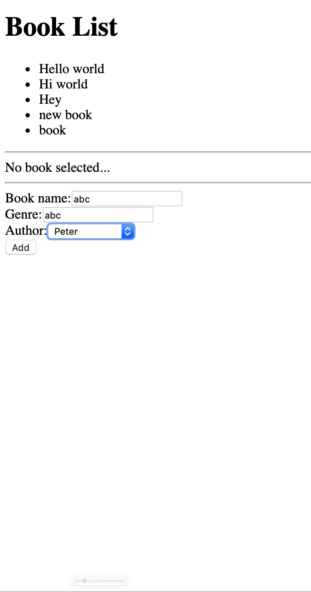
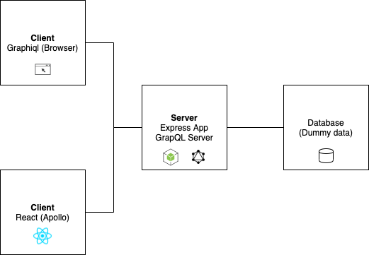
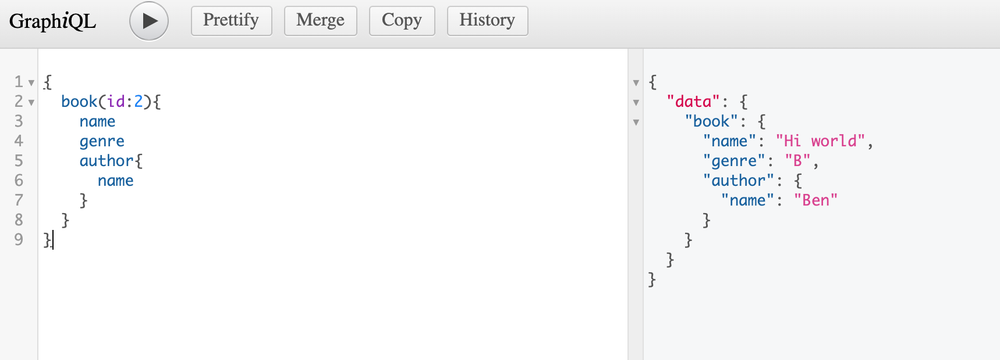
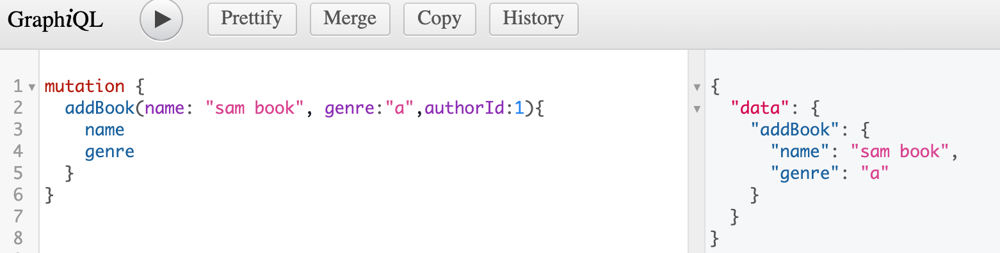

# BookListApp
## Table of Content
1. [App info](#appinfo)
2. [Technologies](#technologies)
3. [Design](#design)
4. [Features](#features)
5. [Installation](#installation)
6. [Reference](#reference)


<a name="appinfo"></a>
## App info
This web app is to create something like To-do-list. The main purpose is to use GraphQL as the method between front-end application and back-end server and database.  
<p align="center">
  
</p>

<a name="technologies"></a>
## Technologies  
This project is created with
- [React js](https://github.com/facebook/create-react-app)
- [Express js](./img/graphql2.png)
- [GraphQL](https://graphql.org/)

<a name="design"></a>
## The design


<a name="features"></a>
## Features
- It uses React.js and Apollo which handles GraphQL query.  
- It displays book list
- It render author list when clicking the select field
- It displays book's detail when clicking the item of book list
- It support adding new book   
- It use express js as GraphQL server
- It doesn't use database, use array instead

### Using graphiql
#### use Query
  

#### use Mutation
  

<a name="installation"></a>
## Installation
### The Client 
```
npm install  
npm start
```
### The Server 
```npm install nodemon -g ```  
It is a tool that automatically restarts the node app when there are some changes saved.
```
npm install
nodemon app.js
```

<a name="reference"></a>
## Reference
[GraphQL Tutorial](https://www.youtube.com/playlist?list=PL4cUxeGkcC9iK6Qhn-QLcXCXPQUov1U7f) from TheNetNinja.
